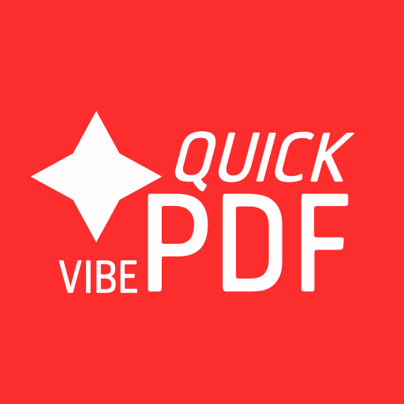

# VibeQuickPDF



แอป Flutter ขนาดเล็กและรวดเร็วสำหรับแปลงรูปภาพเป็นไฟล์ PDF

## เหตุจูงใจสำหรับการพัฒนาแอปพลิเคชั่น

คนในครอบครัวมีความต้องการในการทำไฟล์ PDF อยู่บ่อยครั้ง ตอนแรกผมได้เขียนแอปขึ้นมาโดยไม่ใช้ AI (จนถึงตอนนี้แอปตัวนั้นก็ยังถือว่าใช้งานได้) แต่ว่าด้วยความที่ผมอยากลองมีประสบการณ์ Vibe-Coding แอปพลิเคชั่นเพื่อมาใช้งานส่วนตัวเป็นหลัก และทำเป็นเรซูเม่และแจกจ่าย Source Code ไปด้วยเป็นรอง เลยออกมาเป็นโปรเจคนี้ครับ

โดยผมมีแผนที่จะ Maintain โปรเจคนี้ไปเรื่อยๆ หากผมไม่มีอะไรทำ หรือไม่ลืมไปอ่ะนะ (555)

### สร้างด้วยการ Vibe Code

เวอร์ชั่น | โมเดล
:-------------------------: | :-------------------------:
เวอร์ชั่น 1.0.0 - 1.2.2 | Gemini 3.1 Pro
เวอร์ชั่น 1.3.0 - ล่าสุด | Gemini 3.8 Flash

## รูปภาพตัวอย่าง

หน้าหลัก (ว่างปล่าว)          |  หน้าสร้างไฟล์ PDF
:-------------------------:|:-------------------------:
  | 
  | 

## คุณสมบัติ

- **แปลงไฟล์ได้อย่างรวดเร็ว**: แปลงชุดรูปภาพเป็นไฟล์ PDF หรือบีบอัดเป็นไฟล์ ZIP
- **ตัวเลือกการส่งออกที่ยืดหยุ่น**: เลือกรวมไฟล์เป็นเอกสารฉบับเดียว (Merge) หรือแยกไฟล์ภาพแต่ละหน้าแยกชิ้น
- **พรีวิวเอกสารก่อนส่งออก**: ดูตัวอย่างไฟล์ PDF ชั่วคราวได้ทันที พร้อมลบไฟล์ตัวอย่างอัตโนมัติเมื่อปิดหน้าจอพรีวิว
- **รองรับการรับไฟล์แชร์จากแอปอื่น**: รับไฟล์รูปภาพ หรือแตกไฟล์รูปภาพจากไฟล์ Archive (เช่น `.zip`, `.tar.gz`) เพื่อนำเข้าสู่แอปได้โดยตรง พร้อมตัวเลือกแทนที่หรือต่อท้ายรายการเดิม
- **จัดการและจัดเรียงหน้าได้ง่าย**: ปรับเปลี่ยนลำดับของภาพ (ลากวางหรือกดเลื่อนตำแหน่ง) ลบภาพรายหน้า หรือล้างรายการทั้งหมด
- **ตรวจสอบสถานะการแชร์**: มีระบบตรวจจับและแจ้งเตือนให้ลองแชร์ใหม่หากกระบวนการแชร์ไม่สมบูรณ์
- **รองรับ Dark Mode & สลับภาษา**: มีธีมโหมดมืด/สว่าง/ตามระบบ และรองรับการสลับภาษาทั้งไทยและอังกฤษ

## ความต้องการระบบ

- Flutter (stable channel)
- SDK ของแพลตฟอร์มสำหรับ Android และ iOS

## เริ่มต้นอย่างรวดเร็ว

โคลนรีโพ และติดตั้ง dependencies:

```bash
git clone https://github.com/JittiponPannak/VibeQuickPDF.git
cd VibeQuickPDF
flutter pub get
```

## โครงสร้างโปรเจกต์

- [lib/main.dart](lib/main.dart): จุดเริ่มต้นของแอป การกำหนด Theme และการรองรับ Localizations
- [lib/screens/home_screen.dart](lib/screens/home_screen.dart): หน้าแรกแสดงรายการ PDF และเมนูการตั้งค่าธีม/ภาษา
- [lib/screens/conversion_screen.dart](lib/screens/conversion_screen.dart): หน้าเลือกรูปภาพ จัดเรียง พรีวิว และส่งออกไฟล์เป็น PDF หรือ ZIP
- [lib/services/file_service.dart](lib/services/file_service.dart): จัดการไฟล์ PDF ชั่วคราวและถาวร รวมถึงการแชร์ไฟล์
- [lib/services/pdf_service.dart](lib/services/pdf_service.dart): ตรรกะการสร้างเอกสาร PDF
- [lib/services/archive_service.dart](lib/services/archive_service.dart): จัดการสร้างไฟล์ ZIP และแตกไฟล์รูปภาพจากไฟล์ประเภท Archive
- [lib/models/pdf_file.dart](lib/models/pdf_file.dart): โมเดลข้อมูลเมตาของไฟล์ PDF
- [lib/widgets/shared_media_dialog.dart](lib/widgets/shared_media_dialog.dart): Dialog จัดการรูปภาพที่ได้รับจากการแชร์
- [lib/l10n/app_localizations.dart](lib/l10n/app_localizations.dart): ระบบจัดการข้อความรองรับหลายภาษา (ไทย/อังกฤษ)
