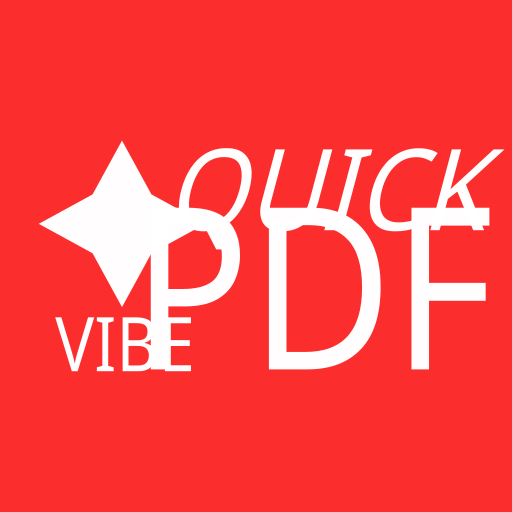

# VibeQuickPDF

<center>


แอป Flutter ขนาดเล็กและรวดเร็วสำหรับแปลงรูปภาพเป็นไฟล์ PDF

</center>

## เหตุจูงใจสำหรับการพัฒนาแอปพลิเคชั่น

คนในครอบครัวมีความต้องการในการทำไฟล์ PDF อยู่บ่อยครั้ง ตอนแรกผมได้เขียนแอปขึ้นมาโดยไม่ใช้ AI (จนถึงตอนนี้แอปตัวนั้นก็ยังถือว่าใช้งานได้) แต่ว่าด้วยความที่ผมอยากลองมีประสบการณ์ Vibe-Coding แอปพลิเคชั่นเพื่อมาใช้งานส่วนตัวเป็นหลัก และทำเป็นเรซูเม่และแจกจ่าย Source Code ไปด้วยเป็นรอง เลยออกมาเป็นโปรเจคนี้ครับ

โดยผมมีแผนที่จะ Maintain โปรเจคนี้ไปเรื่อยๆ หากผมไม่มีอะไรทำ หรือไม่ลืมไปอ่ะนะ (555)

## รูปภาพตัวอย่าง

หน้าหลัก (ว่างปล่าว)          |  หน้าสร้างไฟล์ PDF
:-------------------------:|:-------------------------:
  | 

## คุณสมบัติ
- การแปลงภาพเป็น PDF อย่างรวดเร็ว
- ปุ่มส่งออกด่วน (Quick Export) สร้างและแชร์ PDF ทันทีโดยบันทึกแค่ชั่วคราวสำหรับการส่งไฟล์ และไม่เก็บถาวร
- ตรวจสอบความสำเร็จของการแชร์ และมีระบบแจ้งเตือนให้ลองใหม่หากแชร์ไม่สำเร็จ
- เลือกรองรับการรับรูปภาพที่แชร์มาจากแอปอื่น
- แชร์ หรือบันทึกไฟล์ PDF ที่สร้างขึ้น

## ความต้องการระบบ
- Flutter (stable channel)
- SDK ของแพลตฟอร์มสำหรับ Android และ iOS

## เริ่มต้นอย่างรวดเร็ว

โคลนรีโพ และติดตั้ง dependencies:

```bash
git clone https://github.com/JittiponPannak/VibeQuickPDF.git
cd VibeQuickPDF
flutter pub get
```

## โครงสร้างโปรเจกต์

- [lib/main.dart](lib/main.dart): จุดเริ่มต้นของแอป
- [lib/screens/home_screen.dart](lib/screens/home_screen.dart): UI หน้าแรกและการไหลหลัก
- [lib/screens/conversion_screen.dart](lib/screens/conversion_screen.dart): หน้าเลือกภาพและแปลงเป็น PDF
- [lib/services/file_service.dart](lib/services/file_service.dart): ฟังก์ชันช่วยจัดการไฟล์และการเข้าถึงที่เก็บ
- [lib/services/pdf_service.dart](lib/services/pdf_service.dart): ตรรกะการสร้าง PDF
- [lib/models/pdf_file.dart](lib/models/pdf_file.dart): โมเดลข้อมูลเมตาของ PDF
